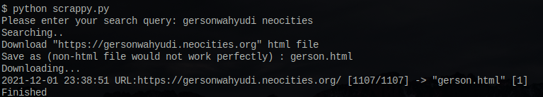

# Scrappy 
> A python script to scrap html file from top DDG site result



## About
This script is to scrap the top result from DDG searches. The search query is from your input though it is generated by the DDG search engine.

## Dependencies
- ``requests`` to send HTTP request
- ``BeautifulSoup`` to parse the HTML file

## How to execute the script
```
git clone https://git.sr.ht/~gersonwahyudi/scrappy
cd scrappy
python scrappy.py
```
